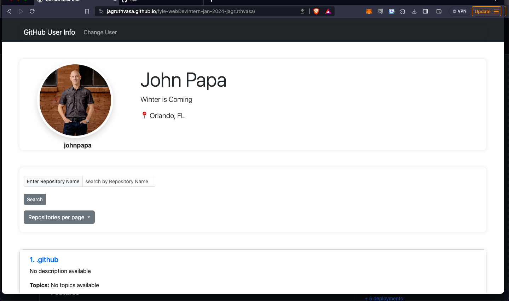

<!-- GitHub User Info README -->

## GitHub User Info

 

This project allows users to retrieve and display information about a GitHub user, including their repositories. It provides a user-friendly interface for exploring a user's profile and repositories.


### Features

- Fetch and display user information (avatar, bio, username, etc.).
- Display user repositories with pagination and search functionality.
- Responsive design for a seamless user experience on various devices.


### Hosted URL

Visit the hosted site [here](https://jagruthvasa.github.io/fyle-webDevIntern-jan-2024-jagruthvasa/).


### Technologies Used

- [](https://getbootstrap.com/)
- [](https://developer.mozilla.org/en-US/docs/Web/HTML)
- [](https://developer.mozilla.org/en-US/docs/Web/CSS)
- [](https://developer.mozilla.org/en-US/docs/Web/JavaScript)

<p align="right">(<a href="#readme-top">back to top</a>)</p>

### Getting Started

To run the project locally, follow these steps:

1. Clone the repository.
   ```sh
   git clone https://github.com/jagruthvasa/fyle-webDevIntern-jan-2024-jagruthvasa.git

2. METHOD 1 : Open the folder in Visual Studio Code and go to extesnions and install Live server extension. Now Right Click on index.html and select open with Live Server.
3. METHOD 2 : Directly open index.html file in Browser

### Usage

- Enter a GitHub username and click "Submit" to fetch user information.
- Explore user details, repositories, and use search and pagination features.


<!-- ROADMAP -->
### Achieved
- [x] Pagination has to be server-side
- [x] By default, show `10` repositories per page
- [X] User should be able to choose a maximum of `100` repositories per page.
- [X] When the API calls are in progress, consider showing loaders.
- [X] Search bar to filter the repositories.
- [x] The assignment has to be done in HTML, CSS and Javascript. You can use Bootstrap and Jquery but no other library/design system is allowed.
- [x] Usability: Intuitive, user-friendly interface.
        Simple and clean interface. Showing search button, Showing clear filter button (which clears the filters)
- [x] Readability: The cleanliness and structure of the codebase.
        Added Comments for every function and every variable for clear understanding.

<p align="right">(<a href="#readme-top">back to top</a>)</p>


### Video Demo


[fyle-demo.webm](https://github.com/jagruthvasa/fyle-webDevIntern-jan-2024-jagruthvasa/assets/60261491/4abb79de-dfda-4e14-904c-1b7468483576)


<!-- CONTACT -->
### Contact

Vasa Sai Jagruth - [@LinkedIn](https://www.linkedin.com/in/jagruth/) - jagruthvasa@gmail.com - 9010545613

<p align="right">(<a href="#readme-top">back to top</a>)</p>
